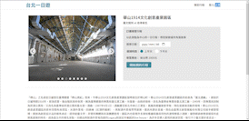
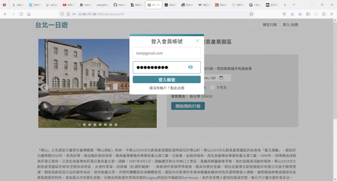
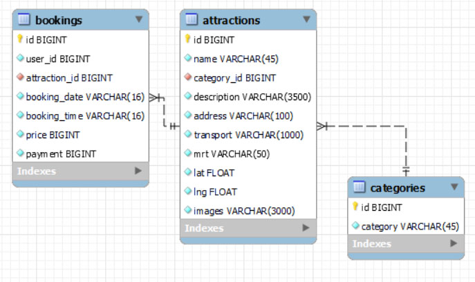

# ✨ 台北一日遊 ✨✨

## 什麼是 台北一日遊 ???

以台北 58 個景點，上午下午兩個時段做為行程訂購主軸的電商網站。

### **LIVE DEMO**: http://52.68.197.98:3000/

## ✨Features ✨

### ✦ Python Flask MVC

### ✦ Validate form using Regular Expression in JavaScript and python

  

### ✦ Infinite scroll

  

- Uses lazy loading and executes its demand to load more data

### ✦ Infinite Carousel

- Click radio or button to change image.
- Infinite Loop

### ✦ Toggle Password Visibility

  

| Test             |  ✨ |  Input Value   |
| :--------------- | --: | :------------: |
| Account(Login)   |     | test@gmail.com |
| Password (Login) |     |   Test12345    |

### ✦ Database normalization

  

### ✦ Third Party (TapPay) Payment System

- Direct Pay - Pay by Prime API

| Credit Card   |  ✨ |     Input Value     |
| :------------ | --: | :-----------------: |
| Account       |     | 4242 4242 4242 4242 |
| Expire        |     |        04/24        |
| security code |     |         123         |

## ✨ Built With

### Frontend

- Vanilla JS
- Scss

### Backend and Database

- Python
- Python Flask
- Jinja 2
- MySQL

### Deploy with

- AWS EC2(Ubuntu)
- Vim

## ✨Package Version

| Package                |  ✨ | Version |
| :--------------------- | --: | :-----: |
| Flask-Bcrypt           |     |  1.0.1  |
| Flask-JWT-Extended     |     |  4.4.4  |
| mysql-connector-python |     | 8.0.30  |
| PyJWT                  |     |  2.6.0  |
| requests               |     | 2.28.1  |

##
